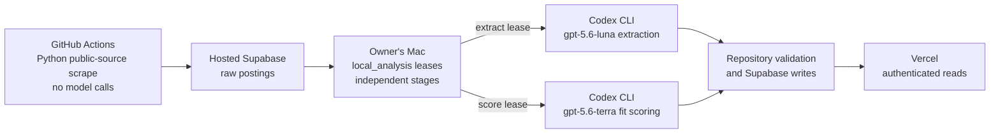

# Cloud pipeline

This is the canonical map for where Job Radar Coach fetches, analyzes, stores,
and serves job data. It describes repository source contracts; it does not prove
that a workflow, local worker, database write, or deployment ran successfully.

The GitHub workflow invokes `python -m scraper.cloud_run`. That entry point
forces annotation off, fetches only reviewed public sources within per-source
network budgets, and writes raw posting data through the hosted `DATABASE_URL`.
It contains no extraction or scoring call. Cloud fetching therefore remains
independent of whether the owner's Mac is awake.

On the Mac, `scripts/local_analysis.py` claims expiring `extract` and `score`
leases and processes a bounded number of eligible hosted rows. Repository source
pins extraction to `gpt-5.6-luna` and fit scoring to `gpt-5.6-terra` for this
worker. The dedicated worker forces `BRAIN=codex` and the stage-specific model
through its in-process environment; it does not use the stored `runtime.brain`
value to choose its provider. Extraction sends the bounded raw job description
as its prompt. Its separate provider-routing snapshot contains only
`runtime.brain`, while the dedicated worker's environment takes precedence.

Scoring is an independent stage whose current eligibility is based on a
substantive raw job description and status/profile freshness, without requiring
an extraction row. It builds its request from the public posting, the validated
professional profile projection, and the bounded application-history
projection. The professional projection can include desired roles, stacks,
levels, salary, red-flag terms, free-text preferences, tenure, positioning,
depth, and verified fit signals. Those preferences are scoring data rather than
provider selection. The validators check schemas, evidence identifiers,
semantic constraints, and current input fingerprints before a result is stored.

The Vercel application reads the validated hosted records through authenticated
server routes. The Mac is required for local Codex extraction and scoring. It is
not required for the scheduled Python scrape or for Vercel to read already
stored results.

Each cloud run also rechecks up to 60 stored job URLs and retries descriptions
for up to 12 stored rows whose text is missing or short. Both queues rotate by
their last-attempt timestamps so an uncertain result does not starve later
rows. Unknown fetch results remain unknown, and an accepted description is
stored completely without replacing an existing complete description.

## Schedule and cost contract

The workflow's GitHub Actions native schedule is `17 */6 * * *`: 00:17, 06:17,
12:17, and 18:17 UTC. Minute 17 avoids the documented high-load period at the
start of each hour. `workflow_dispatch` remains available, while workflow
concurrency prevents two scraper jobs from running at once and each job retains
its 30-minute timeout.

Scheduled workflows are best effort. GitHub documents that scheduled events can
be delayed during high load and that some queued jobs may be dropped. In public
repositories, scheduled workflows are automatically disabled after 60 days
without repository activity. Scheduled workflows run from the latest commit on
the default branch, so merging source and observing a live scheduled run are
separate proof layers. See GitHub's official
[scheduled-workflow documentation](https://docs.github.com/en/actions/reference/workflows-and-actions/events-that-trigger-workflows#schedule).

GitHub states that standard GitHub-hosted runner use is free in public
repositories. Actions artifacts share the plan-level storage allowance with
GitHub Packages. Actions caches have a separate default allowance of 10 GB per
repository, with distinct billing when an increased limit is used. Larger
runners are charged. This workflow uploads seven-day evidence artifacts, so
free runner compute does not imply unlimited artifact storage. See GitHub's
official [Actions billing documentation](https://docs.github.com/en/billing/concepts/product-billing/github-actions).
This GitHub runner policy does not cover the local Codex CLI subscription or its
usage quotas; Luna and Terra inference is provided through that CLI rather than
weights running on the Mac.

The optional
[Supabase Cron dispatcher](../supabase/scheduling/cloud_scrape/README.md) exists
for installations that deliberately choose database-driven dispatch. It must
never run alongside the native GitHub schedule.
